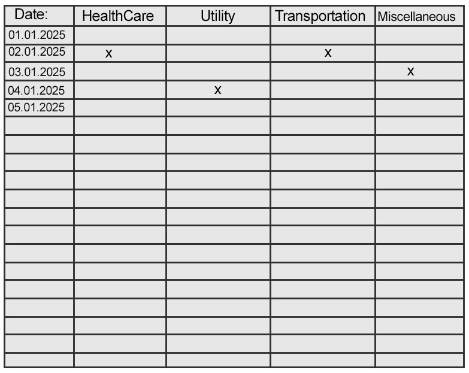

### **"Expense Tracking Dynamic Web Application with Basic Backend Integration"**

---

### Important Notice:

    - You can ignore this assessment task, if you are not agree with our offered salary.
    - Please note: Completing the task does not **guarantee**  that you will move on to the next round.

---

**Task overview:**
Build a web application where users can easily input and keep track of their daily expenses in different categories. This app will assist users in managing their finances by organizing, summarizing, and setting limits on their spending. We've included some drawings of the user interface for you to check out. Take a look at the attached drawing at the bottom to get an idea of how the user interface will look!

**Functional Requirements:**

1. **Expense Input:**

   - Users can enter expenses in categories such as Groceries, Transportation, Healthcare, Utility, Charity, and Miscellaneous.
   - For each expense entry, users must specify the purpose of the expense (e.g., "Groceries for the week").
   - The date and time of the expense should be automatically recorded when the expense is added.

2. **Expenses Management:**

   - Expenses are stored in your MongoDB database.
   - Users can input expenses multiple times per day.

3. **Summary Page:**

   - The application should display a categorized summary of the user’s expenses for each day.
   - The total daily expenses should be calculated and displayed under the specific date.
   - Tooltips should be shown when users hover over any expense field, revealing more detailed information about the purpose of the expense.

4. **Spending Limit:**

   - Upon starting this application, the user should be prompted to set a monthly spending limit.
   - Users can set a spending limit for each category (e.g., Groceries: $200, Transportation: $50).
   - Users should not be able to add expenses that exceed the set limits.
   - The system should alert users when they have reached their spending limit for any specific categories

5. **Technologies Required:**

   - Frontend: HTML, raw CSS, Next JS, Redux Toolkit
   - Backend: Node.js (Express.js)
   - Database: MongoDB

6. **Redux Toolkit for State Management:**

   - Use Redux Toolkit to manage the application state efficiently.
   - Define actions and reducers using createSlice to handle tasks, including creation, updates, deletion, filtering, and reminders.
   - Ensure that Redux slices are well-organized and located in appropriate directories to maintain a clean and maintainable codebase.

**Backend Integration:**

- The backend should be built using Node.js (Express.js), with MongoDB for data storage.
- Create simple API endpoints for:
  - Creating a task (`POST /api/tasks`)
  - Retrieving tasks (`GET /api/tasks`)
  - Updating a task (`PUT /api/tasks/:id`)
  - Deleting a task (`DELETE /api/tasks/:id`)
- Document the API endpoints in the README.

**Restrictions:**

- Please don't use any CSS libraries
- Please use Next.js only as frontEnd frameworks
- Style your application using raw CSS not any CSS libraries

**Non-Functional Requirements:**

- Code should be clean, modular, and maintainable, with appropriate comments explaining key parts.
- The application can be single/multiple page application and fully functional without page reloads.
- Avoid using unnecessary dependencies; only use essential packages.

**Submission Guidelines:**

- Submit the application as a Git repository, by replying the email
- Include a README file detailing the application setup, how to run it, and any known issues or limitations.
- All code must be original, and candidates should refrain from using online solutions or tutorials.

**Evaluation Criteria:**

- Quality of the frontend code and UI/UX design.
- Proper integration with the backend API endpoints and use of Redux for state management.
- Responsiveness, accessibility, and user-friendliness of the application.
- Cleanliness, modularity, and maintainability of the codebase.
- Creativity and problem-solving in adhering to task requirements.

### Timeline:

- You will have **5 days** to complete this task. Please send your completed task (GitHub repository link) in public mode and the deployment link by replying to the email we sent you. Thank you!

### Screen when application starts:

### When user insert expanse:

### Expanse summaries from inserted data, make sure to show full month:

